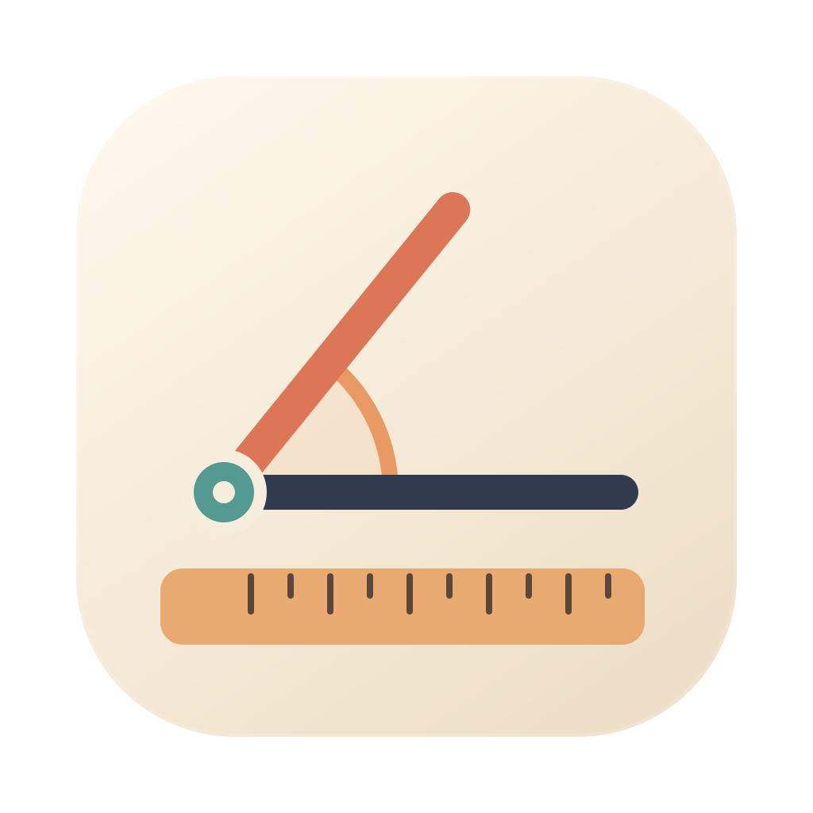
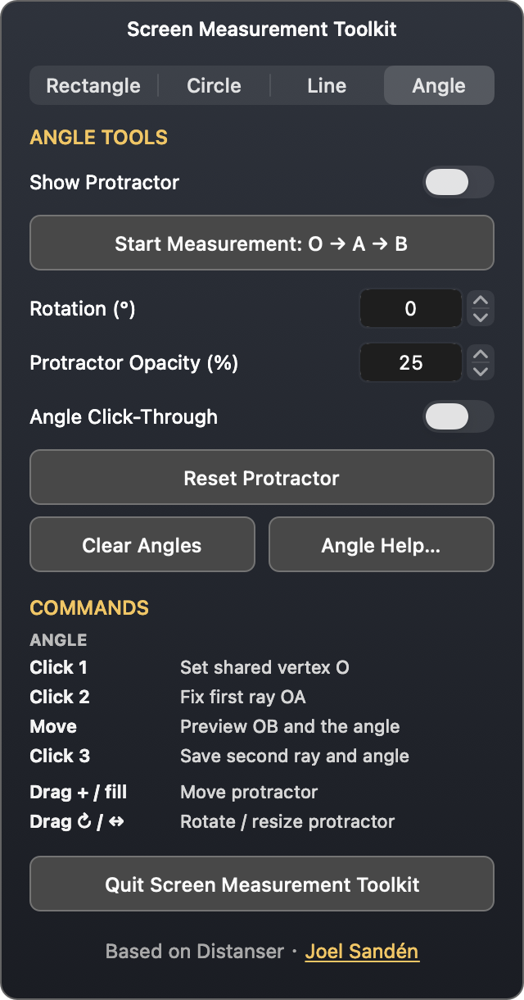

# Screen Measurement Toolkit

A native macOS toolkit for screen rulers, shapes, guides, a translucent protractor, and shared-vertex angle measurement.

[中文说明](README.zh-CN.md) · [User guide](docs/USER_GUIDE.zh-CN.md) · [GitHub publishing guide](docs/PUBLISHING.zh-CN.md)

## Features

- Horizontal/vertical rulers, rectangle/circle/line measurement and guides.
- A dedicated **Angle** tab: show the protractor, start a measurement, adjust rotation and fill opacity, toggle click-through, reset and clear angles.
- Three clicks: shared vertex **O**, first endpoint **A**, then **B**. Pointer movement previews OB and the 0–180° angle; only the third click commits.
- Drag O/A/B to edit, drag a line or badge to move the measurement, and copy the angle.
- English and Simplified Chinese, switched immediately from **Language / 语言** in the menu bar.
- The **Dual Measure** icon combines a straight ruler with a shared-vertex angle.

Supports macOS 13+. Release packages contain an Apple Silicon + Intel universal app. The app lives in the menu bar and does not require Accessibility or Screen Recording access for measurement.



## Install

Download the DMG from this repository's **Releases**, open it, and drag **Screen Measurement Toolkit.app** into **Applications**. Open the menu-bar icon to access Controls and Language.

The supplied local build uses an ad-hoc signature and has not been notarized. Internet downloads may require macOS's **System Settings → Privacy & Security → Open Anyway**. See the publishing guide for Developer ID signing and notarization before wider distribution.

## Build and check

Requires Xcode Command Line Tools; checks also use Python 3. There are no third-party runtime dependencies.

```sh
./Tools/check.sh                 # AppKit UI/interaction checks, opens temporary test windows
./Tools/check.sh --geometry-only # Computation, migration and upstream license checks; no GUI
./build.sh                      # Universal app in build/Screen Measurement Toolkit.app
./build.sh --fast               # Native architecture only
./package.sh                    # Universal app + DMG, app/source ZIPs and checksums in build/dist/
python3 Tools/export-source.py   # Export an editable source ZIP without building
./run.sh                        # Native build and launch
```

The editable icon masters are `Resources/AppIcon.svg` and `Resources/StatusIcon.svg`. Committed PNGs keep ordinary builds independent of an SVG-rendering dependency. `Tools/make-icon.swift` generates the macOS iconset and ICNS.

## Layout

```text
Sources/ScreenMeasurementToolkit/
  App/           Bootstrap, menu, identity and persisted ruler settings
  Localization/  Live English / Simplified Chinese bindings
  UI/            Controls, Angle panel, gestures and help
  Rulers/        Rulers and screen overlays
  Guides/        Guide windows and persistence
  Shapes/        Shape drawing, editing and readouts
  Angles/        Protractor, shared-vertex model, capture and editing
Resources/       Product metadata, icons and privacy manifest
Checks/          Real AppKit checks and upstream core fingerprints
Tools/           Checks, icon generation and compatibility entry points
docs/            Usage, publishing, release notes and upstream provenance
```

## Attribution and license

Derived from [Distanser](https://github.com/simpel/ruler), originally written by **Joel Sandén**, from baseline `1bc14313ebc3c6108928eeb16b98bb25f9f23cec` (1.8.0). This independent derivative adds angle tools, bilingual controls, new identity and packaging.

**MIT License**. The original `Copyright (c) 2026 Joel Sandén` and complete permission/warranty text are preserved verbatim in [LICENSE](LICENSE). [NOTICE](NOTICE) records the upstream and modifications. Both files ship with the application and DMG.
