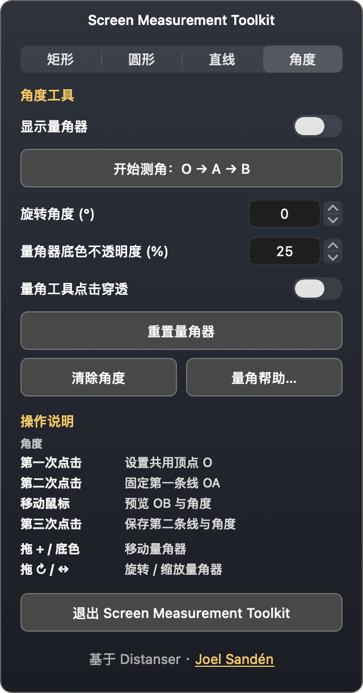

# Screen Measurement Toolkit



原生 macOS 屏幕测量工具，基于 [Distanser](https://github.com/simpel/ruler)，保留原作者 **Joel Sandén** 的版权与完整 MIT 许可。

支持 macOS 13+，提供 Apple Silicon + Intel 通用安装包。

## 主要功能

- 水平 / 垂直直尺，矩形、圆形与直线测量，十字线与导线。
- **角度**选项卡可开关量角器，开始三次点击测角，调整旋转与底色不透明度，设置点击穿透，重置、清除或打开帮助。
- OA 与 OB 共用顶点 O。鼠标移动实时预览第二条线，第三次点击才保存角度。
- 拖动顶点与端点编辑，拖线或读数条移动，复制角度。
- 菜单栏 **Language / 语言** 即时切换英文与简体中文并保存。
- 应用与菜单栏使用 **03 Dual Measure / 双重测量** 图标。

安装和操作见 [使用说明](docs/USER_GUIDE.zh-CN.md)，发布见 [GitHub 发布指南](docs/PUBLISHING.zh-CN.md)。

## 开发

```sh
./Tools/check.sh
./build.sh
./package.sh
```

源码按 App、Localization、UI、Rulers、Guides、Shapes、Angles 拆分。检查会核对 22 个上游核心 Swift 文件，确保尺子、几何计算、绘图与导线处理在重构后保持原行为，并核对原 MIT 许可全文。

## 许可与来源

原始项目：Distanser，https://github.com/simpel/ruler 。原作者：Joel Sandén。原始源码基线：`1bc14313ebc3c6108928eeb16b98bb25f9f23cec`，版本 1.8.0。

本项目独立维护，新增角度工具、中英文界面、图标与项目结构。原始版权声明与完整 MIT 文本保留在 [LICENSE](LICENSE)，来源与修改说明见 [NOTICE](NOTICE)。二者随源码、应用和 DMG 分发。
